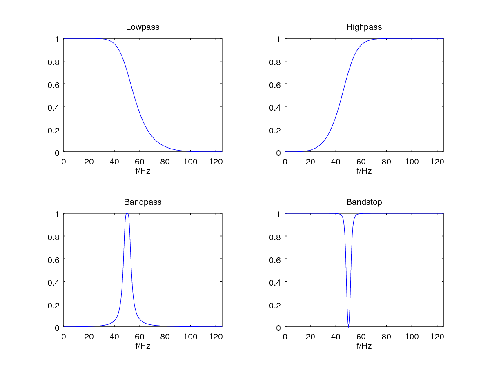

# iirj

An IIR filter library written in JAVA.

Highpass, lowpass, bandpass and bandstop as
Butterworth, Bessel and Chebyshev Type I/II.

You can also calculate the filter coefficients with Python's
scipy and then create your custom IIR filter.
See the `python-design` subdirectory.

It's based on the IIR1 library [https://github.com/berndporr/iir1]
which in turn is based on Vinnie Falco's DSPFilters [https://github.com/vinniefalco/DSPFilters].



## Usage

`import uk.me.berndporr.iirj.*;`

### Constructor

  `Butterworth butterworth = new Butterworth();`

### Initialisation
1. Bandstop

   `butterworth.bandStop(order,Samplingfreq,Center freq,Width in frequ);`

2. Bandpass

   `butterworth.bandPass(order,Samplingfreq,Center freq,Width in frequ);`

3. Lowpass

   `butterworth.lowPass(order,Samplingfreq,Cutoff frequ);`

4. Highpass

   `butterworth.highPass(order,Samplingfreq,Cutoff frequ);`

### Filtering
Sample by sample for realtime processing:

```
v = butterworth.filter(v)
```

## Coding examples
See the `*Test.java` files for complete examples
for all filter types. Run them with `mvn test`. These test programs
write the different impulse responses of the filters to text files.

## Installation

## Local install
 - Clone this repository
 - Run `mvn install` to add it to your local maven respository

## Maven central

At [](https://search.maven.org/search?q=g:%22uk.me.berndporr%22%20AND%20a:%22iirj%22)
click on the iirj version number and then choose the appropriate installation option, for
example for Android studio.

## Android Studio
```
dependencies {
    implementation group: 'uk.me.berndporr', name:'iirj', version: '1.5'
}
```
Android studio will automatically notify you if a new IIR library is available.

## Documentation
* Online: https://berndporr.github.io/iirj/
* `mvn javadoc:javadoc` generates the JavaDocs
* `mvn site` generates the web pages containing the documentation
under `target/site` describing all commands in detail.

## Testing
`mvn test` creates impulse responses in the subdirectories
for the different filters: `target/surefire-reports`.

To see the impulse and frequency responses run:
```
python3 ./plot_impulse_fresponse.py <filter>
```
where is <filter> is bessel, butterworth, chebyshevI or chebyshevII.

The script DetectorTest uses a bandpass filter to detect the
heartbeats of an ECG recording faking a matched filter which could
be also seen as a 1st approximation of a wavelet. The heartrate is
stored in hr.txt.


Have fun

/Bernd Porr
[http://www.berndporr.me.uk]

